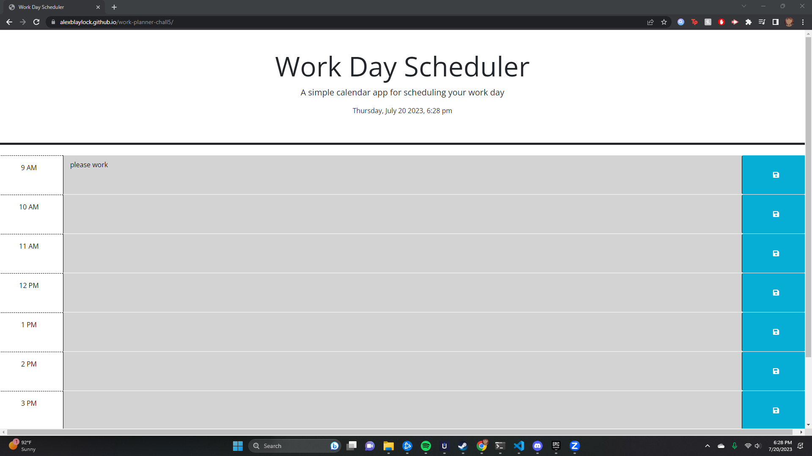

This is a work planner that I made for people who work 9-5 jobs and want to schedule out their day. It has a timer at the top so you know what time it is, and updates to the time to adjust whether the time blocks are in the future, in the past, or in your current hour.

This project had a lot of struggles, I had to do a lot of research due to me feeling like I did not fully understanding jquery and dayjs and how to just overall do this project. I looked at github and saw how https://github.com/njthanhtrang/5.-Third-Party-APIs-Challenge-Work-Day-Scheduler/tree/main this version of the project was done and I used that to help me start. I did find out that that repo did not have the project completely finished, and would not adjust timers, so I had to read around MDN, Stackoverflow, and jquery to see how to fix this. 

I could not get localstorage to work on my end, so I will have to come back and fix this another time.

sources I used:
https://api.jquery.com/
https://developer.mozilla.org/en-US/docs/Web/JavaScript
https://github.com/njthanhtrang/5.-Third-Party-APIs-Challenge-Work-Day-Scheduler/tree/main

link to my page
https://alexblaylock.github.io/work-planner-chall5/
link to repo
https://github.com/AlexBlaylock/work-planner-chall5
